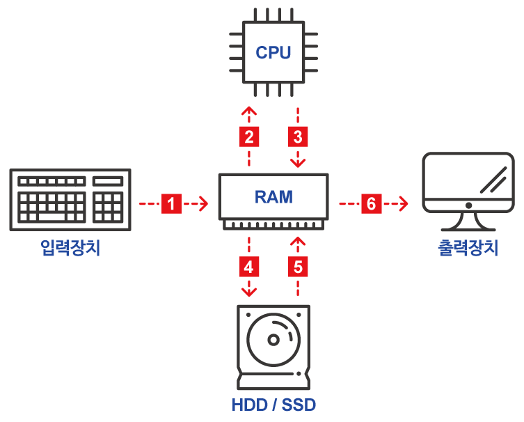

# 컴퓨터를 구입할 때 무엇을 고려해야 할까요?

### 학습 목표

1. 컴퓨팅이 다른 분야의 혁신에 어떠한 영향을 끼쳤는지 설명해 봅시다.
2. 컴퓨터의 하드웨어에는 어떤 요소들이 있는지 설명해 봅시다.

* 하드웨어
* 중앙처리장치
* 기억장치
* 입출력장치

---

 #### 하드웨어

> 컴퓨터를 물리적으로 구성하는 요소이며, 컴퓨터에 연결되어 추가적인 기능을 수행한다. 하드웨어에는 다양한 형태와 구성 요소가 있다.

#### 컴퓨터 내의 하드웨어

**컴퓨터 하드웨어에서의 데이터 흐름**

컴퓨터 하드웨어는 크게 **중앙처리장치**, **기억장치**, **입출력장치**로 구성된다.

* 중앙처리장치(Central Processing Unit, CPU)
  * 프로세서라고도 불림
  * **입력장치에서 받은 명령을 실제로 처리**한다.
  * CPU가 1초에 얼마나 많은 연산을 할 수 있는지 속도를 측정하는 단위는 기가헤르츠(GHz)이다.
* 기억장치
  * 입력된 명령이나 데이터가 저장되는 공간
  * 주기억장치와 보조기억장치로 나뉜다.
  * 주기억장치에는 **RAM**이 있다. RAM은 기억된 정보를 읽어내기도 하고 다른 정보를 기억시킬 수 있는 메모리로서, 응용 프로그램을 일시적으로 불러오거나, 데이터를 일시적으로 저장하는데 사용되는 **임의 접근 기억 장치**이다.
  * RAM이 메모리에 얼마나 많은 양의 정보를 저장 할 수 있는지 측정하는 단위는 보통 기가바이트(GB)이다.
  * 보조기억장치인 (1) **하드드라이브(C:)는 영구적으로 데이터를 저장**한다. 
  * 많이 쓰이는 (2)**하드디스크(Hard Disk Drive, HDD)** 는 원판 모양의 플래터를 회전시켜 드라이브에 데이터를 읽고 쓰는 원리이다.
  * (3) **SSD(Solid State Drive)** 는 움직이는 부품 없이 더 빠른 속도로 데이터를 읽고 쓰는 대신 가격이 비싸다.
  * 이동식 저장공간 기기인 플래시 드라이브는 USB 메모리 스틱 등 다양한 이름으로 불린다.
  * 저장용 드라이브 외에도 광학 디스크 드라이브라는 것이 있는데 컴퓨터가 CD나 DVD를 읽고 쓸 수 있게 한다.
* 입력장치 + 출력장치 = **입출력장치**
  * 입력장치 : 마우스, 키보드, 스캐너 ...
  * 사용자가 입력한 자료를 컴퓨터가 이해할 수 있는 형태로 변환하는 장치
  * 출력장치 : 모니터, 프린터 ...
  * 모니터의 크기는 보통 대각선 끝과 끝의 길이를 인치로 표시한다.
  * 해상도는 우리가 이미지를 볼 때 얼마나 선명하게 볼 수 있는 가를 숫자로 나타낸다.
  * 화면에 이미지를 확대해 보면 하나의 작은 점으로 나타나는데 이 하나의 작은 점을 픽셀이라고 한다. 즉, 픽셀의 개수가 해상도가 된다. 
  * 픽셀의 개수 up 해상도 up 선명한 이미지

#### 주변기기

> 컴퓨팅에 사용되는 모든 하드웨어가 컴퓨터 내부에 존재하는 것은 아니다. 컴퓨터 자제부품이 아닌 경우 보통 컴퓨터와 연결하여 사용하는데, 이런 기기들을 보통 주변기기라고 한다. 키보드 , 외장 스피커 ...

주변기기는 보통 컴퓨터에 있는 물리적 포트에 꽂혀 컴퓨터에 연결된다. 많이 알려진 포트로는 USB(범용 직렬 버스) 포트가 있다.

