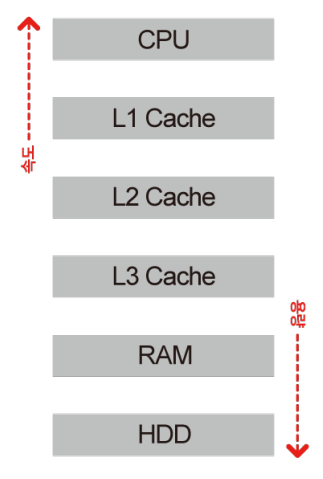

# 컴퓨터는 수 많은 정보를 어떻게 기억할까요?

### 학습 목표

1. 컴퓨터에 쓰이는 기억장치의 의미를 정확하게 알 수 있습니다.
2. 기억장치의 종류를 알고, 각각의 크기와 속도를 비교해 봅시다.

* 기억장치
* RAM
* 캐시
* 가상 기억장치

---

#### 기억장치

> 컴퓨터가 계산을 수행하기 위해서는 비트와 바이트의 형태로 기억장치에 저장할 수 있어야한다. 컴퓨터가 나중에 데이터를 검색할 수 있도록 보관을 하는 것이다. 하지만 기억장치는 종류마다 서로 다른 속도를 내고 내부에 저장할 수 있는 양에 차이가 있어, 서로 다른 장단점을 가지고 있다.

#### CPU 캐시, 하드디스크, RAM

* CPU
  * 용량이 매우 큰 파일이나 데이터를 처리해야 하지만, 한번에 32 또는 64bit의 블록 단위로 굉장히 적은 양의 데이터를 조작하고 계산한다. 하지만 중앙처리장치는 이러한 비트들을 굉장히 **빠른 속도로 처리**할 수 있다.
* 하드디스크
  * CPU보다 훨씬 **많은 양의 데이터를 저장**할 수 있다.
  * 하드디스크는 엄청나게 많은 양의 데이터를 기억장치에 저장할 수는 있지만, 데이터를 읽고 쓰는데에 **많은 시간이 소요**된다.
* RAM
  * 이 중간에 있는 임의 접근 기억 장치
  * RAM은 하드디스크보다 훨씬 빠르게 데이터를 읽고 쓸 수 있어서, 실행중인 프로그램이나 열려있는 파일들이 더 빨리 접근될 수 있도록 메모리를 저장하는 데에 쓰인다.

#### L1, L2, L3 캐시

> RAM보다 더 빠르게 정보를 읽고 쓰는 더 작은 단위의 기억장치들도 있지만, 용량이 더 작다.

* 속도 : L1 > L2 > L3 
  * 제일 느린 L3도 RAM보다는 빠르다.

* 저장용량 : L3 > L2 > L1

### 타협점

일반적으로, 기억장치의 타협점은 용량과 속도에서 찾는다. 속도가 빠른 기억장치는 용량이 작은 경향이 있다. 그리고 속도가 빠른 기억장치는 각 용량 단위의 가격이 더 비싸다.

우리가 컴퓨터에서 여러 프로그램을 실행하기 위해서는 운영체제와 프로그램을 동시에 실행시켜야 하는데 이 때 RAM을 사용한다. 너무 많은 공간의 RAM이 사용되면, 근래의 운영체제는 **가상 기억장치**라는 것을 써서 일시적으로 데이터를 RAM에서 하드디스크로 옮기고, 사용자가 필요로 할 때 다시 정보를 불러온다. 

