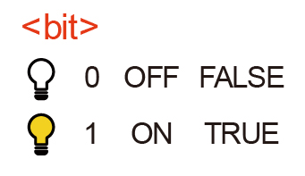
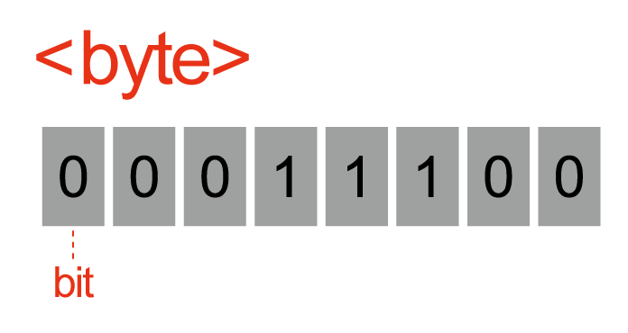
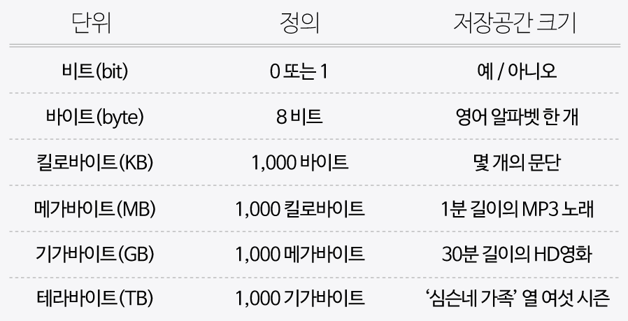

# 컴퓨터는 자료를 어떻게 처리할까요?

### 학습 목표

1. 데이터를 표현하는 추상적 개념의 종류에 대해서 이야기해 봅시다.
2. 2진 수열이 디지털 데이터를 어떻게 표현하는지 설명해 봅시다.

* 비트
* 바이트

---

#### 비트

> 정보를 저장하고 연산을 수행하기 위해 컴퓨터가 쓰는 측정 단위
>
> **이진 숫자**라는 뜻을 가진 binary digit의 줄임말이며, **0과 1, 두 가지 값만 가질 수 있는 측정 단위**이다. 

디지털 데이터를 여러 비트들로 나타냄으로써 두 가지 값만을 가지고도 많은 양의 정보를 저장할 수 있다. 또한 컴퓨터는 저장되어 있는 데이터를 수정하기 위해 비트에 수학적 연산을 수행할 수 있다.

#### 비트열

> 바이트는 **여덟 개의 비트가 모여 만들어진 것**이다.

하나의 비트는 **0과 1**, 이 두 가지의 값만 저장할 수 있다. **(켜기=1, 끄기=0)**

하지만 비트 한 개는 많은 양의 데이터를 나타내기에 턱없이 부족하다. 그렇기 때문에 여러 숫자 조합을 컴퓨터에 나타내기 위해 비트열을 사용한다.

하나의 바이트에 여덟 개의 비트가 있고, 비트 하나는 0과 1로 표현될 수 있기 때문에 **2^8 = 256개**의 서로 다른 바이트가 존재할 수 있다.

바이트가 모이면 더 큰 단위가 될 수 있다. 

#### 다양한 데이터 표현하기

하나의 비트로는 어떠한 값이 참인지 거짓인지, (예를 들면, 노트북이나 휴대전화가 충전 중인지 아닌지에 대한 정보만 컴퓨터에 저장할 수 있다.) 하나의 바이트(8 bit)로 알파벳 하나를 표시할 수 있다.

더 큰 데이터 단위는 좀 더 복잡한 유형의 데이터를 저장할 수 있다. 