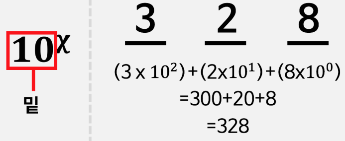
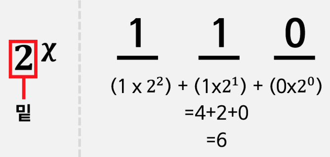
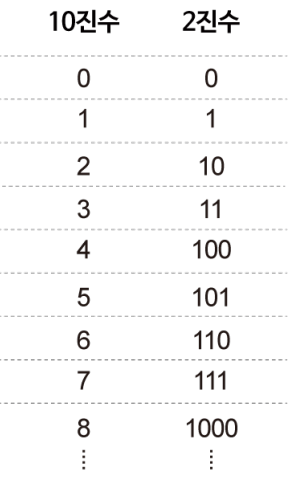

# 컴퓨터가 숫자를 어떻게 셀까요?

### 학습 목표

1. 디지털 데이터를 표현하기 위하여 이진법이 어떻게 사용되는지 설명할 수 있다.

* 이진수
* 10진수

---

#### 2진수

> 컴퓨터는 비트 형태로 데이터를 나타낸다. 비트란 이진법의 최소단위로, 숫자 0,1로 신호를 나타내는 최소의 단위
>
> 컴퓨터는 2진수 체계를 사용한다.

#### 수체계

우리가 사용하는 수 체계인 **10진수는 0부터 9까지 10개의 숫자를 이용하여 값을 표현한다.**

#### 2진수에서 숫자 세는 방법

