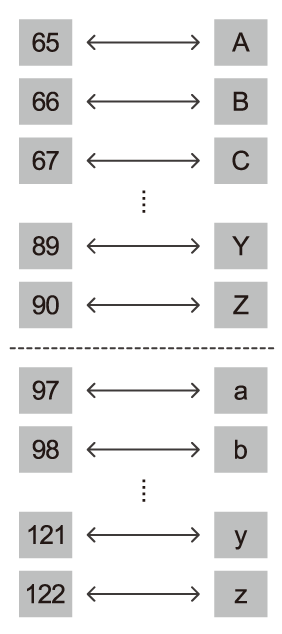

# 컴퓨터는 문자를 어떻게 표현할까요?

### 학습 목표

1. ASCII 인코딩 방식을 이해하고, ASCII 코드를 이용하여 텍스트 데이터를 나타내 봅시다.
2. 디지털 데이터를 나타내기 위해 이진 데이터들이 어떻게 사용되는지 설명해봅시다.

* ASCII
* ASCII표
* 인코딩
* 유니코드

---

#### ASCII 코드

> **문자를 컴퓨터가 이해할 수 있는 이진 데이터로, 혹은 그 반대로 변환하는 표준 방법**

#### ASCII 인코딩 표준

> 아스키는 컴퓨터가 텍스트 데이터를 저장하기 위해 흔하게 사용하는 표준코드체계

**ASCII에서 소문자는 같은 대문자 글자보다 항상 2^5만큼 크다.**

이진수에서 2^5의 자릿수만 바꾸면 되기 때문에 (소문자는 1, 대문자는 0으로) 소문자와 대문자간의 변환이 쉽다.

#### ASCII의 한계

**기본 ASCII 코드 표는 7비트만** 이용해서 모든 문자들을 나타낸다. 이것은 ASCII 코드로 2^7개, 즉 128개의 문자를 나타낼 수 있다는 것이다.

**확장 ASCII는 8번째 비트를 추가**하여 총 256개의 문자를 나타낼 수 있다.

알파벳은 52개뿐이므로 그 외 남는 공간에 기호, 숫자, 몇몇 심볼들(%,$ ..)등 다른 종류의 문자들을 나타낼 수 있다.

하지만 8비트 ASCII 코드로도 나타낼 수 없는 문자들이 아직도 많이 있다.

우리가 사용할 수 있는 문자들의 개수는 256개보다 많기 때문이다.

이 때문에 훨씬 더많은 문자들을 포함할 수 있는 **유니코드(Unicode)**가 생겼다. 

