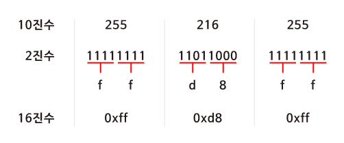
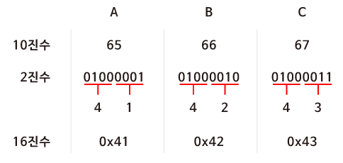

# 2진수로 표현하기엔 너무 길어요. 좋은 방법이 없을까요?

### 학습 목표

1. 디지털 데이터의 또 다른 표현 방법인 16진수에 대해서 알아봅시다.
2. 16진수를 사용했을 때의 장점에 대해서 이야기해 봅시다.

* 16진수
* 0x

---

#### 16진수

> 컴퓨터과학에서는 10진수나 2진수 대신 **16진수(Hexadecimal)** 로 표현하는 경우가 많다.

#### 10진수를 16진수로 바꾸어보기

jpg 이미지 파일은 항상 255 216 255로 시작되고 이것은 10진수이다. 하지만 컴퓨터는 0과 1만을 이해할 수 있기 때문에 실제 컴퓨터 내에서는 10진수를 사용하지 않는다. 

#### 16진수의 유용성

ASCII 코드에 의해 "A, B, C"는 10진수로 65, 66, 67에 해당한다. 2진수로 표현해보면 "01000001 01000010 01000011"이다. 길이가 너무 길다.

하지만 16진수로 표현하면 훨씬 간단해진다. 또한 컴퓨터는 8개의 비트가 모인 바이트 단위로 정보를 표현한다. **2개의 16진수는 1byte의 2진수로 변환**되기 때문에 정보를 표현하기 매우 유용하다.

