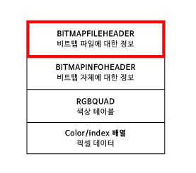

# 컴퓨터는 어떻게 이미지 파일을 구별할 수 있을까요?

### 학습 목표

1. 이미지의 여러가지 유형에 대해 알아봅시다.
2. 컴퓨터는 어떻게 이미지 유형을 구분하는지 생각해 봅시다.

* 이미지 파일 형식
* 확장자
* JPG
* BMP

---

#### 이미지

> 보통 우리가 많이 볼 수 있는 이미지 파일 형식으로는 **비트맵(.bmp), JPG(.jpg), PNG(.png), GIF(.gif)** 등이 있다. 이 외에도 다양한 이미지 파일 유형들이 있는데, 각각의 파일 유형들에는 장점과 단점이 있다. 어떤 파일 유형으로 저장하는가에 따라 이미지 파일이 더 크거나 작을 수 있고, 더 선명하거나 그렇지 않을 수 있다.

#### 사진 파일에 들어있는 정보

하나의 이미지를 다양한 이미지 파일 형식으로 저장할 수 있는데, 저장되는 형식에 따라 파일 안에 들어가 있는 비트 데이터들의 구조 또한 다르다. 이 때문에 각각의 이미지 파일은 보통 첫 부분에 파일을 구분할 수 있는 구분자를 넣어둔다. JPEG의 첫 부분에는 255 216 255라는 10진수로 시작된다.

#### 비트맵 이미지 파일에 들어있는 정보

윈도우에서 많이 볼 수 있는 **BMP** 파일 형식은 이미지 데이터를 가장 단순하게 저장한다. 대신 압축을 하지 않아 파일 크기가 크다는 단점이 있다. BMP 파일 형식 역시 JEPG 파일처럼 파일의 가장 처음 부분에 비트맵 파일에 대한 정보가 있다는 것을 알 수 있다.

JPEG 파일은 이미지를 압축하는 장점을 갖고 있으며, GIF 파일이 256색을 표시할 수 있는데 비해 JPEG는 1600만 색상을 나타낼 수 있어 고해상도를 나타내기에 적합하다.

GIF는 이미지의 전송을 빠르게 하기 위한 압축저장 방식을 사용한다. JPEG보다 압축률을 낮지만 압축 시 이미지의 손상이 적다. PNG는 GIF와 JPEG의 장점만을 합쳐 놓은 압축방식이다. GIF보다 압축률이 좋고 JPEG보다 원본에 손상이 적어 효과적이다.

