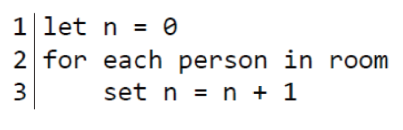
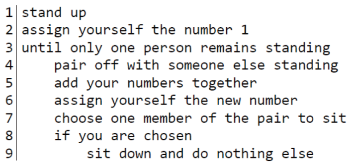

# 알고리즘을 이해하기 쉽게 표현하는 방법이 있을까요?

### 학습 목표

1. 프로그램을 작성하기 전에 의사 코드를 이용하여 설계를 할 수 있습니다.
2. 프로그램을 작성할 때 사용되는 여러 단계의 개념을 확인해봅시다.

* 프로그래밍 언어
* 의사코드
* 할당
* 들여쓰기

---

#### 의사 코드

컴퓨터 프로그램은 **프로그래밍 언어**로 작성된다. 프로그래밍 언어는 일반적으로 **기계가 알아들을 수 있도록 명령을 내리기 위해 사용되는 언어**이다. 프로그래밍 언어는 특정한 문법에 의해 작성된 코드를 요구한다. 알고리즘을 표현하는 방법으로는 자연어(natural language), 의사 코드(Pseudocode), 순서도(flowchart)등이 있다. **의사 코드**는 프로그래밍 언어보다 문법적 제약을 적게 받으므로 알고리즘 표현에 많이 사용된다.

#### 의사 코드의 예시

방 안에 있는 사람의 수를 세기 위한 알고리즘을 만들어야 한다고 생각해보자. 우리는 숫자 0부터 시작할 것이고 방 안에 있는 각각의 사람을 셀 때마다 1씩 더할 것이다.

아래의 의사 코드에서 첫 번째 블록이 이 개념을 표현하고 있다. 이것은 프로그래밍 언어로 작성된 것이 아니지만 형식에 잘 맞추어져 있기 때문에 진행 순서가 매우 정확하고 명확하다. <코드 1>의 1번 줄 처럼 n이라는 **이름을 부여하고 0 값을 넣어주는 것**으로 시작한다. 이 과정은 **'할당'**이라고 불리는데, 이렇게 함으로써 우리가 만드는 코드 내에서 값을 저장할 수 있는 공간 n이 마련되고 거기에 0이라는 값이 초기값으로 들어가게 된다.

이제 방에 있는 각각의 사람을 위해 우리는 n이 n+1이 되도록 다시 할당할 수 있다. 그래서 한 사람씩 늘어날 때마다 1씩 증가시켜 줄 수 있다. 알고리즘의 마지막에서 n은 방 안에 있는 사람 수가 된다.

<코드 1>

더 복잡하지만 효율적인 의사 코드를 보여주기 위해 다른 방법을 사용할 수도 있다. 방 안의 모든 사람을 일으켜 세우고 그들에게 숫자 1을 부여한다. 이제 일어서 있는 다른 사람과 짝을 짓고 그들이 갖고 있던 숫자를 더한 후 한 사람씩 앉는다. 이 과정을 한 사람이 남을 때까지 반복하면 마지막 남은 사람에게 할당된 숫자는 방 안의 총 인원 수가 될 것이다.

이 알고리즘은 <코드 2>에 표현되어 있다. 프로그래밍 언어로 작성되지 않았는데도 이 알고리즘은 굉장히 정교하다. 코드는 어떤 코드 블록이 어떤 문장에 포함되는지 알 수 있도록 **들여쓰기**를 한다. 

<코드 2>

#### 의사 코드의 요소

의사 코드를 작성하는 올바른 방법이란 없다. 어떤 때에는 당신의 목적이 무엇인가에 따라 의사 코드가 더 자세할 수도있다. 프로그래밍 언어와는 다르게, 의사 코드를 어떻게 작성해야 하는지를 정의한 문법은 없다. 그러나 의사 코드에는 자주 사용되는 몇 가지 요소들이 있다. 위의 예시에서 볼 수 있는 것처럼 의사 코드에는 값을 할당한다는 개념이 종종 사용된다. 의사 코드에는 반복문이나 조건문을 포함하기도 한다. 의사 코드에서 사용될 수 있는 이런 개념들은 프로그래밍 언어로 작성된 프로그램에서도 중요한 개념이다. 프로그래밍 언어를 배운 후에도 의사 코드는 문법 걱정 없이 알고리즘ㅇ르 단계별로 표현할 수 있는 유용한 방법이며 프로그램의 논리를 이해하는데 더 효과적인 방법이다.