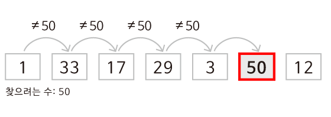

# 자료를 맨 처음부터 하나씩 비교하면서 찾는 방법은 무엇이라고 하나요?

### 학습 목표

1. 알고리즘의 효율성, 정확성, 명확성에 대해 분석해봅시다.
2. 탐색 알고리즘의 가장 기본적인 선형 탐색의 특징에 대해 알아봅시다.

* 선형 탐색

---

#### 효율성 그리고 비효율성

**선형 탐색 알고리즘**은 **정확하지만 아주 효율적이지 못한 방법**이다. 리스트의 길이가  n이라고 했을 때, 최악의 경우 리스트의 모든 원소를 확인해야 하므로 n번만큼 실행된다. 여기서 최악의 상황은 찾고자 하는 자료가 맨 마지막에 있거나 리스트 안에 없는 경우를 말한다. 만약 100만 개의 원소가 있는 리스트라고 가정해본다면 효율성이 매우 떨어짐을 느낄 수 있다. 반대로 최선의 상황은 처음 시도했을 때 찾고자 하는 값이 있는 경우이다. 평균적으로 선형 탐색이 최악의 상황에서 종료되는 것에 가깝다고 가정할 수 있다. 선형 탐색은 **자료가 정렬되어 있지 않거나 그 어떤 정보도 없어 하나씩 찾아야 하는 경우에 유용**하다. 이러한 경우 무작위로 탐색하는 것보다 순서대로 탐색하는 것이 더 효율적이다. 정렬은 시간이 오래 걸리고 공간을 더 차지한다. 하지만 이 추가적인 과정을 진행하면 여러 번 리스트를 검색해야 하거나 매우 큰 리스트를 검색해야 할 경우 시간을 단축할 수 있을 것이다.

