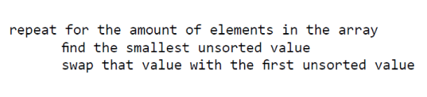
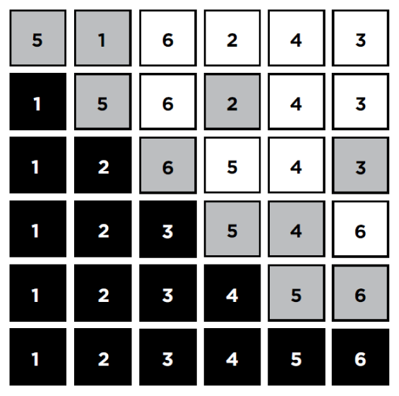

# 자료 중 가장 작은 것을 찾아 순서대로 정렬하는 방법은 무엇일까요?

### 학습 목표

1. 선택 정렬과 버블 정렬의 차이점에 대해서 알아봅시다.
2. 교환 횟수와 비교 횟수의 상관 관계를 생각하면서 선택 정렬의 특징을 살펴봅시다.

* 선택 정렬
* 배열

---

#### 선택 정렬

보통 배열이 정렬되어 있으면 정렬되지 않은 배열보다 더 쉽게 탐색할 수 있다. 정렬을 위한 알고리즘 중 **선택정렬**은 배열 안의 자료 중 가장 작은 수(혹은 가장 큰 수)를 찾아 첫 번째 위치(혹은 가장 마지막 위치)의 수와 교환해주는 방식의 정렬이다. **선택정렬**은 **교환 횟수를 최소화**하는 반면 각 자료를 비교하는 횟수는 증가한다.

#### 실행

5, 1, 6, 2, 4, 3이란 배열이 주어지고 선택 정렬을 이용하여 정렬해줘야 한다면 의사 코드를 아래와 같이 만들 수 있을 것이다.

<코드1>

1. 프로그램은 array라는 배열의 첫 번째 자리(5)에서 시작한다.
2. **가장 작은 원소**를 찾기 위해 5를 (1, 6, 2, 4, 3)와 비교한다.
3. 1이 가장 작은 값이기 때문에 5의 위치와 교환한다.
4. 이제 1은 정렬되었으며 나머지 5, 6, 2, 4, 3은 여전히 정렬되지 않은 상태이다.
5. 다음은 두 번째 자리(5)인데, 정렬되지 않은 오른쪽 (6, 2, 4, 3) 부분만 확인하면 된다.
6. 2가 정렬되지 않은 배열의 원소 중 가장 작은 원소이므로 5와 자리를 바꿔준다.
7. 이와 같은 방식으로 계속해서 비교와 교환을 반복한다.

#### 정렬된 배열

버블 정렬과는 다르게 몇 번의 교환을 해주었는지 횟수를 셀 필요가 없다. 하지만 이 과정은 우리가 해야 할 비교 횟수보다 훨씬 더 많은 비교가 필요하므로 비용이 많이 든다. 원래 배열의 순서와 상관없이, 선택 정렬로 정렬되는 배열은 **n-1번의 교환**이 필요하다. n-1번의 교환은 확실히 버블 정렬의 교환 횟수보다는 적다. 그러나 한 번의 교환이 일어나기 위해서는 정렬되지 않은 수의 모든 비교가 이루어져야 하므로, **n^2번의 비교**가 이루어진다. 선택 정렬은 최선의 경우에도 최악의 경우에서 수행하는 횟수만큼 비교와 교환을 해주어야 한다.