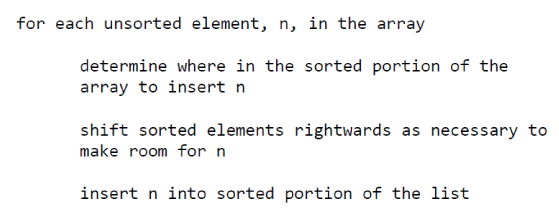
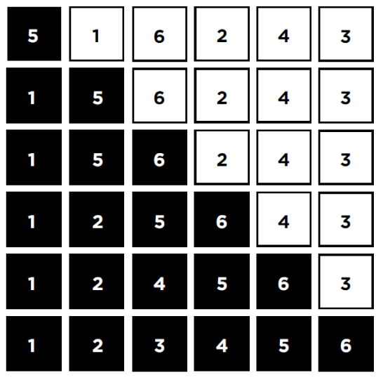

# 정렬된 부분, 정렬되지 않은 부분 나누어 정렬하는 방법은 무엇일까요?

### 학습 목표

1. 삽입 정렬의 비교 횟수와 교환 횟수를 고려하여 효율성에 대해서 생각해 봅시다.

* 삽입 정렬
* 배열

---

#### 삽입 정렬

자료를 정렬하는 또 다른 알고리즘 중 하나인데, 자료를 여러 번 비교하거나 교환할 필요가 없는 방법이 있다. **삽입정렬**은 자료가 정렬된 부분과 정렬되지 않은 부분으로 나누어진다. **정렬되지 않은 부분의 자료가 정렬된 부분의 자리로 삽입되는 형태의 정렬 방법**이다.

#### 실행

삽입 정렬은 배열을 **정렬된 부분과 정렬되지 않은 부분**, 두 개의 부분으로 나누면서 동작한다. 만약 5, 1, 6, 2, 4, 3 이라는 값을 삽입 정렬을 이용하여 정렬해주어야 한다면 아래와 같이 의사코드를 작성할 수 있다.

1. 프로그램이 실행되었을 때, array라는 배열의 첫 번째 자리(5)는 이미 정렬된 부분이라고 간주한다.
2. 정렬되지 않은 부분의 맨 앞 자리인 1은 5보다 작기 때문에 5는 오른쪽으로 이동하고 1이 첫 번째 자리로 온다.
3. 다음으로 정렬되지 않은 부분의 6을 살펴본다.
4. 6은 5보다 크기 때문에 이동할 필요가 없다.
5. 같은 방식으로 계속 실행하면 전체 값이 모두 정렬된다.

#### 정렬된 배열

삽입 정렬은 특정 실행 단계에서, 어떤 원소가 정렬된 배열 내에 자리를 찾았다고 해서 그것이 최종적인 제자리라는 보장은 없다. 다음 단계가 진행되면서 다른 자료에 의해 위치가 바뀔 수 있기 때문이다. 따라서 삽입 정렬은 자료의 양이 적을 때 성능이 우수하며 자료 대부분이 이미 정렬이 되어있는 경우 효율적이다. 삽입 정렬은 이미 정렬된 자료에 새로운 자료를 삽입해야 하는 경우가 발생하면, 정렬된 자료들이 자리를 이동해야 하므로 안정성이 낮다.