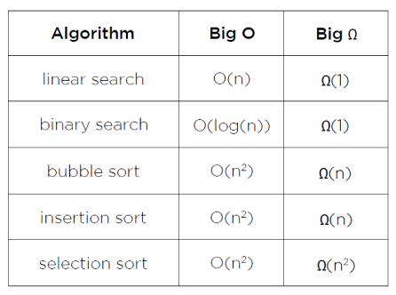

# 정렬 알고리즘의 효율성을 높이기 위해서는 무엇을 고려해야 할까요?

### 학습 목표

1. 다양한 정렬과 탐색 방법의 시간복잡도를 비교해 봅시다.
2. 알고리즘의 효율성이 프로그램에 어떤 영향을 미치는지 생각해 봅시다.

* 시간 복잡도
* Big-O 표기법
* Big Ω

---

#### 시간 복잡도

**시간 복잡도**란 **알고리즘을 수행할 때 걸리는 시간을 기준으로 효율성을 분석하는 것**이다. 시간 효율성이란 결국 알고리즘에서 비교와 교환 등이 일어날 때 **연산자의 처리 횟수가 적다**는 의미이며, 연산자의 처리 횟수가 적다는 건 시간의 복잡도가 낮다는 의미이다. 따라서 시간 복잡도가 낮을수록, 연산자의 사용 횟수가 적을수록 효율성이 높은 알고리즘이 된다.

#### Big-O 표기법

**Big-O 표기법**은 컴퓨터 과학에서 "대략"을 나타내는 공식적인 개념으로 최악의 경우에 대한 시간 복잡도를 나타내는 표현이다. 

**선형 탐색**은 비교적 간단한데 **찾는 값이 배열의 맨 끝에 있는 최악의 상황**의 경우 이 값을 찾는데 **n번의 단계**를 거치면 된다. 이 개념은 **O(n)**으로 나타난다.

**버블 정렬**에서는 인접해 있는 자료와 쌍을 이루어 비교하기 때문에, **n개의 자료를 갖는 배열은 n-1쌍을 비교**한다. n개의 자료가 있을 때 n-1번 비교해주면, n번째의 자료가 정렬되어있다. 그 이후로 n-1개의 자료를 다시 비교하게 된다. 전체 비교 횟수는 (n-1) + (n-2) + ... + 1 은 n(n-1)/2이며, n^2/2-n/2로 나타낼 수 있다. 시간 복잡도는 가장 중요한(가장 지수가 큰) 부분만 남기고, 계수를 삭제한다. 따라서 만약 n^2/2-n/2의 가장 중요한 부분은 n^2/2이 되며 이것은 (1/2)n^2이다. 계수를 제외하면 n^2이 남고 **O(n^2)**으로 표현한다.

**선택 정렬**은 가장 작은 값(혹은 가장 큰 값)을 찾아 제 자리를 찾아준다. **n개의 자료가 있다면 첫 번째 자료와 나머지 n-1개의 자료 중 가장 작은 값의 자리를 교환**해주어야 한다. n-1개의 자료 중에서 가장 작은 값을 찾기 위해서는 n-1번의 비교가 필요하다. 즉 비교 횟수는 버블 정렬과 마찬가지로 (n-1) + (n-2) + ... + 1 이며, 시간복잡도는 **O(n^2)**으로 표현한다.

**삽입 정렬**은 **n개의 자료가 있다면 첫 번째 자료는 정렬이 되었다고 생각하고, n-1개의 자료 중 첫 번째 자료와 정렬된 자료를 비교**한다. 이때 정렬된 자료는 1개이기 때문에 비교 횟수는 1이다. 정렬되지 않은 부분에 1개의 자료가 남게 되면, 정렬된 자료의 수 n-1개 만큼의 비교가 필요하다. 따라서 비교 횟수는 1 + 2 + ... + (n-1)이며, 시간복잡도는 **O(n^2)**으로 표현한다.

**Big Ω 표기법**

Big-O와 비슷한 **Big Ω (omega)** **표기법**이 있는데 Big Ω는 **최선의** **경우**를 나타낸다.

**선형 탐색**에서 최선의 경우는 배열의 처음에 찾고자 하는 값이 있는 상황입니다. 이는 배열의 크기와 상관없이 **Ω(1)**이라고 나타낸다.

**버블** **정렬**에서 최선의 경우(이미 정렬된 배열)를 생각해보면 버블 정렬은 교환이 이루어지지 않더라도 배열이 정렬된 사실을 모르기 때문에 여전히 **n-1번의 비교**를 해줘야 한다. 그래서 최선의 경우는 **Ω(n)**로 표기한다.

**선택 정렬** 역시 배열이 정렬되었다는 것을 알 수 없어, 최소값을 계속 찾아주어야 하므로 **Ω(n^2)**로 표기한다.

**삽입 정렬**은 정렬되지 않은 부분에서 정렬된 부분으로 옮겨갈 때, 정렬된 부분의 가장 큰 수와 비교하기만 하면 되기 때문에**Ω(n)**로 표기한다.

