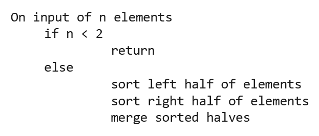
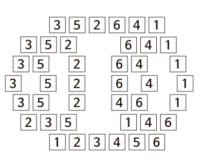

# 많은 자료를 분해하고 다시 합쳐 정렬하는 것을 무엇이라고 할까요 ?

### 학습 목표

1. 다른 정렬 알고리즘과 비교했을 때 합병 정렬만의 차이점을 이야기해봅시다.

* 합병 정렬
* 분할 정복

---

#### 합병 정렬

전화번호부의 분할 정복 탐색처럼 데이터를 반으로 나누어간다는 것과 공통점이 있는 방법인 **합병 정렬(병합 정렬)**이 있다. 합병 정렬은 **원소가 한 개가 될 때까지 계속해서 반으로 나누다가 다시 합쳐나가며 정렬을 하는 방식이다.** 

#### 실행

합병 정렬은 배열의 원소들이 반으로 나누어지는 과정과 정렬된 후 합쳐지는 과정으로 나누어져 있다.

만약 3, 5, 2, 6, 4, 1이라는 배열을 가지고 합병정렬을 이용하여 정렬해야 한다면 의사코드로 아래와 같이 작성할 수 있다.

1. 이 프로그램이 시작되면 6개의 원소를 가진 배열은 반으로 나뉘고, 원소가 1개가 될 때까지 계속해서 나뉘어지게 된다.
2. 모든 원소가 1개가 되었을 때, 다시 합치면서 정렬이 이루어지게 된다.
3. step 4에서 5로 넘어가면서 3과 5의 크기를 비교하고 정렬된 채로 넘어가는 것처럼 나머지 나누어진 부분도 같은 방식으로 병합된다.

#### 정렬된 배열

분할 정복은 모든 데이터를 다 보는 것이 아니라 **절반을 그리고 그 절반을 보는 방식**으로 진행되어 탐색 시간이 굉장히 짧았다. 합병 정렬 역시 반을 나눈다는 개념이 사용되기 때문에 시간이 적게 들 것이라고 유추할 수 있다. 

만약 8개의 원소가 있다면 3번 나누어질 것이다. 따라서 n개의 원소가 있을 때 완전히 다 나누어지기까지 호출되는 함수의 개수는 log n 개라는 것을 알 수 있다. 그리고 합병 정렬은 병합하는 알고리즘을 포함한다. 합쳐지는 과정에서 각 원소들의 크기를 비교하기때문에 n번의 비교 과정이 있다. 즉 한번 나누어질 때마다 n번의 비교 횟수가 추가되는 것이다. 따라서 합병 정렬의 시간 복잡도는 **O(n log n)**이다.