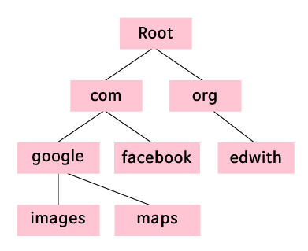

# 복잡한 IP 주소를 몰라도 인터넷을 사용할 수 있는 이유는 무엇일까요 ?

### 학습 목표

1. 인터넷 주소를 검색했을 때 어떻게 목적지에 도달할 수 있는지 생각해봅시다.

* DNS
* DHCP
* URL
* 도메인

---

#### DNS와 DHCP

인터넷상에 있는 장치들이 IP 주소를 효과적으로 사용할 수 있도록 하는 두 가지 중요한 시스템이 마련되어 있다. **도메인 이름 시스템(Domain Name System) 혹은 DNS**는 구글 크롬이나 인터넷 익스플로러 같은 웹 브라우저 주소창에 치는 텍스트를 IP 주소로 변환해준다. **동적 호스트 구성 프로토콜(Dynamic Host Configuration Protocol) 혹은 DHCP**는 **각 장치에 IP 주소를 할당**하는 것을 도와준다.

#### DNS

대부분의 사람들은 웹 페이지에 접속하려 할 때 IP 주소를 치지 않는다. 그 대신에 **URL**을 입력한다. URL, 즉 **도메인 주소**는 IP 주소 보다도 사람이 읽기 쉽고 기억하기 쉬운 웹 주소이다.

사용자가 기억하기 쉬운 URL을 사용하더라도 궁극적으로는 접근하려는 장치의 IP주소를 알아야 한다. 그래서 **DNS**가 필요한 것이다. DNS는 google.com이나 facebook.com 같이 식별자 역할을 하는 **도메인을 그와 대응하는 IP 주소로 바꿔준다.**

웹 브라우저에 URL을 치면, 컴퓨터는 DNS 서버에 접속한다. DNS 서버는 어느 도메인 이름이 어떤 IP 주소와 대응하는지에 대한 정보를 저장하고 있다. DNS 서버는 여러 개가 있다. 어느 도메인 이름이 어떤 IP 주소와 대응하는지에 대한 정보가 바뀔 때 모든 DNS 서버들에 들어있는 정보가 같은 시간에 업데이트되는 것은 아니다. 그렇기 때문에 DNS 시스템의 변경 사항이 인터넷상의 모든 DNS 서버로 전달되는데 시간이 걸리더라도, DNS 서버끼리는 서로 변경된 사항에 대해 공유해야 한다.

DNS에서 관리하는 도메인은 트리 형태의 계층 구조로 이루어져 있다. 기본 최상위 도메인(TLD) 집합이 있는데, TLD는 우리가 익숙한 웹 사이트 주소 마지막 부분이다. (com, net, org, edu 등). 웹 사이트 URL들은 이러한 **최상위 도메인**들 중 하나로부터 가지를 뻗어나간다. 예를 들어 "google.com"은 최상위 도메인 "com"에서부터 가지를 뻗어나간다. 어떤 웹 사이트는 더 멀리 뻗어나가기도 한다. 이러한 가지들을 **서브 도메인**이라 한다. "image.google.com"과 "maps.google.com"은 서브 도메인의 예이다.

#### DHCP

컴퓨터는 IP 주소를 할당 받는 방법이 있어야 한다. 예전에는 네트워크 관리자가 일일이 컴퓨터에 IP 주소를 할당하는 일을 했었다. 지금은 동적 호스트 구성 프로토콜 혹은 **DHCP**가 이 일을 자동으로 해준다. 컴퓨터가 네트워크에 연결할 때, 컴퓨터는 한 DHCP 서버에 연결할 것이다. DHCP 서버는 사용 가능한 IP 주소 풀에 접근할 수 있고, **네트워크상에 있는 컴퓨터 각각에 고유한 IP 주소를 할당**하는 일을 한다.

DNS와 DHCP를 사용하면 인터넷상의 장치들은 자기 자신의 IP 주소를 받을 수 있고, 장치들은 사용자가 방문하려는 웹 사이트가 어느 IP 주소와 대응하는지 알 수 있다. 이러한 과정은 인터넷 프로토콜이 인터넷을 통해 효과적으로 통신하도록 해 주는 중요한 단계들이다.

