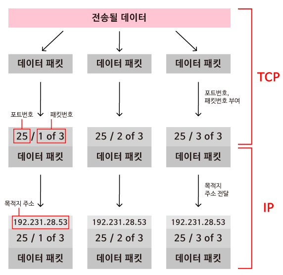

# 데이터는 어떤 과정을 거쳐서 최종 목적지에 무사히 도착하게 되는 걸까요?

### 학습 목표

1. TCP와 IP의 기능과 역할에 대해서 알아봅시다.
2. 데이터가 인터넷을 통해 전송되기 위해서 거치는 과정에 대해서 생각해봅시다.

* IP
* 라우터
* 패킷
* TCP
* 포트

---

#### TCP와 IP

컴퓨터들이 인터넷을 통해 통신하기 위해서는 통신을 어떻게 해야 하는지, 인터넷상의 한 지점에서 다른 지점으로 어떻게 데이터가 도달하는지 알려주는 표준 집합 혹은 프로토콜이 필요하다. 프로토콜 없이는 수신 장치가 정보를 받게끔 보장하거나 받은 정보로 무엇을 해야 할 지 보장해줄 수 없다. 프로토콜에는 **TCP**로 알려진 **전송 제어 프로토콜(Transmission Control Protocol)**과 **IP**로 알려진 **인터넷 프로토콜(Internet Protocol)**이다. 둘을 함께 써서 **TCP/IP**로 알려져 있다.

#### 전송 제어 프로토콜

한 컴퓨터가 다른 컴퓨터로 데이터를 보낼 때 커다란 하나의 패킷을 작은 패킷들로 나누어 보내게 된다. **전송 제어 프로토콜(TCP)**는 **데이터를 순서 있는 패킷들로 분해**하는 일을 한다. 패킷들이 같은 시간에, 같은 순서로 목적지에 도착한다는 보장이 없기 때문에 **TCP는 각 패킷에 대해 순서에 맞게 번호를 매긴다.** 이러한 방법으로 수신 컴퓨터는 받은 **패킷들을 올바른 순서로 재조립**할 수 있게 된다. 

패킷 번호를 할당하는 것 외에도, **TCP는 데이터에 포트 번호를 할당**한다. 이 **데이터가 어떤 유형의 인터넷 서비스에 사용되는지**를 나타내기 위해서이다. 예를 들어, SMTP(이메일)은 25번 포트를 사용하지만 HTTP(일반 웹 검색)은 80번 포트를 사용한다.

#### 인터넷 프로토콜

**인터넷 프로토콜(IP)**은 **정보가 한 컴퓨터에서 다른 컴퓨터로 어떻게 전송되는지에 대한 규칙들을 모아놓은 것**이다. 인터넷 프로토콜은 연결된 라우터들의 망으로 만들어진다. 라우터는 한 컴퓨터에서 다른 컴퓨터로 정보를 보내는 것을 도와주는 장치이다. 송신 장치에서 목적지까지 가기 위해 데이터는 보통 여러 라우터들을 거쳐가야한다. 각 라우터는 최종 목적지까지 가기위해 어느 방향으로 데이터를 보내야 하는지 알아낼 때 필요한 지시 정보들의 집합으로 만들어져있다.

#### TCP/IP

인터넷이 통신하기 위한 과정을 요약하면, 인터넷을 통해 데이터를 받기 위해서 우선 데이터가 더 작은 패킷들로 분해되어야 하고, TCP는 각 패킷에 포트 번호와 패킷 번호를 매긴다. **IP가 패킷의 목적지를 알려주면 라우터들을 통해 데이터가 전송된다.** 라우터들은 마침내 패킷을 목적지로 보내줄 것이다.

