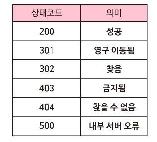

# 웹 서버는 사용자와 필요한 정보를 어떻게 주고받을까요?

### 학습 목표

1. 웹 브라우저와 웹 서버가 대화하기 위해서는 어떤 것이 필요한지 생각해 봅시다.
2. 서버가 요청한 것이 어떻게 수행했는지 알려주는 상태코드를 알아봅시다.

* HTTP
* GET
* POST
* 상태코드

---

#### HTTP

**HTTP(Hypertext Transfer Protocol)**은 **웹 브라우저가 웹 서버와 대화하기 위한 프로토콜**이다. 사용자가 웹 페이지를 방문하려 할 때, 그들의 웹 브라우저(클라이언트)는 웹 서버에 웹 페이지의 내용을 요청해야 한다. 웹 서버는 그 요청에 응답하기 위해 요청을 해석하고, 요청된 페이지를 클라이언트에게 돌려보낸다. HTTP는 이 과정을 용이하게 해주며, 요청을 보내고 받는 표준적인 방법을 정해준다.

#### GET과 POST 요청

사용자가 웹 브라우저에 URL을 입력해 웹 페이지를 요청하면, 웹 브라우저는 **GET** 요청이라는 특정한 유형의 HTTP 요청을 보낸다. GET 요청은 단어 GET으로 시작되고 GET 뒤에는 요청 **URI**을 써주는데, 이것은 사용자가 요청한 웹 페이지의 경로를 나타낸다. URI는 Uniform Resource Identifier의 약자이다. **/**는 **웹 페이지의 최상위 경로**를 나타낸다. 

웹 브라우저는 **POST** 요청이라는 다른 유형의 HTTP 요청을 보낼 수 있다. POST요청은 **사용자가 온라인 폼에 데이터를 입력하고 웹 서버로 데이터를 전송할 때 사용**된다.

#### 상태코드

웹 서버가 클라이언트로부터 HTTP 요청을 받을 때, 서버는 클라이언트로 응답을 돌려보내야 한다. 예를 들어, 클라이언트가 웹 페이지를 요청하면 서버는 웹 페이지의 내용을 돌려보내야 한다.

서버는 클라이언트에게 요청의 결과를 나타내는 **상태 코드**를 함께 보내주면서 응답한다. 서버에 사용자가 찾는 페이지가 있고 성공적으로 응답할 수 있으면, 서버는 **상태 코드 200**을 보낸다. **요청이 성공적으로 처리**되었다는 의미이다. 

